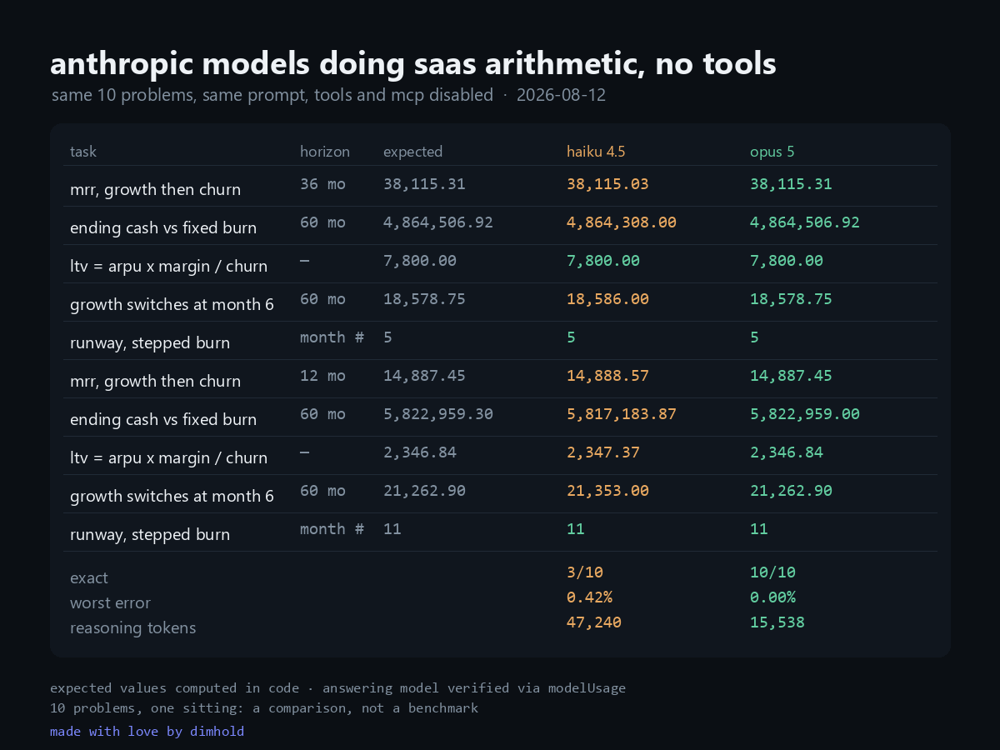

# llm-arithmetic

**Ten pieces of SaaS arithmetic, every tool taken away. opus-5 matched the computed value on 10 of 10. haiku-4-5 matched on 3 of 10, and spent three times the reasoning tokens getting there.**

Run date: 2026-08-12. Models: `claude-haiku-4-5`, `claude-opus-5`, through the Claude Code CLI.

## The question

"Language models cannot do arithmetic" is repeated often enough that people build around it without checking what the error actually looks like. So I gave two models ten pieces of arithmetic a founder actually asks for, MRR after N months, ending cash, LTV, a growth rate that changes mid timeline, runway with stepped burn, under identical conditions with every tool removed so each model has to do the maths itself.

## Method

- **Isolation.** Built in tools are disabled with `--tools ""` *and* MCP servers are disabled with `--strict-mcp-config --mcp-config no-mcp.json`. Both are needed: `--tools ""` alone still leaves MCP servers reachable, and a connected MCP that can run SQL would quietly do the arithmetic. Isolation was verified rather than assumed. Asked to read a local file containing a random string, the model answers that it has no Read tool.
- **Same everything.** Both models get the same ten questions, the same prompt ("Do not show any working... reply with exactly one line: `ANSWER: <number>`"), the same isolation.
- **Self contained questions.** Each question states its own rule, for example "in this exact order: MRR first grows by 7.0%, then 2.4% of the resulting MRR churns away". A wrong answer is therefore an arithmetic error rather than a disagreement about how to model a business.
- **Ground truth** is computed in [`run.ts`](run.ts), never by a model.
- **Deterministic task set.** Tasks are generated from seed `20260812`, so the same command reproduces the same ten questions.
- **The answering model is verified** against `modelUsage` in the CLI response rather than assumed from `--model`. A call that never reached the requested model fails loudly instead of being scored.
- **Rate limits are retried** with backoff and never counted as wrong answers.

```
claude -p --output-format json --model <model> \
  --tools "" --strict-mcp-config --mcp-config no-mcp.json
```

### Not measured, on purpose

**Wall clock time.** It measures the network as much as the model, and this run was made on a slow connection. Reasoning token counts are reported instead. They come from the API response and do not depend on the link.

### Metric

Relative error `|answer − expected| / |expected|`, reported as: exact, within 1%, within 5%, median and worst. **Exact** means the answer differs from the computed value by no more than display rounding (relative error ≤ 1e-6). A looser bar would score a $199 miss on a $4.8M forecast as correct.

## Results

Ten arithmetic problems, two Anthropic models, no tools, no MCP, single shot answers. Expected values computed in code.

| | claude-haiku-4-5 | claude-opus-5 |
|---|---|---|
| answered | 10 / 10 | 10 / 10 |
| exact | **3 / 10** | **10 / 10** |
| within 1% | 10 / 10 | 10 / 10 |
| worst error | **0.42%** | 0.00% |
| reasoning tokens (total) | **47,240** | 15,538 |

"Exact" means the answer differs from the computed value by no more than display rounding (relative error ≤ 1e-6). A looser threshold would score haiku's `4,864,308` against an expected `4,864,506.92` as correct. It is $199 short.

### Per task

| task | expected | haiku-4-5 | error | opus-5 | error |
|---|---|---|---|---|---|
| `mrr-0` growth then churn, 36 mo | 38,115.31 | 38,115.03 | 0.001% | 38,115.31 | 0.000% |
| `cash-1` revenue vs fixed burn, 60 mo | 4,864,506.92 | 4,864,308 | 0.004% | 4,864,506.92 | 0.000% |
| `ltv-2` one division | 7,800.00 | 7,800 | 0.000% | 7,800 | 0.000% |
| `two-phase-3` growth switches at m6, 60 mo | 18,578.75 | 18,586 | 0.039% | 18,578.75 | 0.000% |
| `runway-4` stepped burn, month number | 5 | 5 | 0.000% | 5 | 0.000% |
| `mrr-5` growth then churn, 12 mo | 14,887.45 | 14,888.57 | 0.008% | 14,887.45 | 0.000% |
| `cash-6` revenue vs fixed burn, 60 mo | 5,822,959.30 | 5,817,183.87 | 0.099% | 5,822,959 | 0.000% |
| `ltv-7` one division | 2,346.84 | 2,347.37 | 0.022% | 2,346.84 | 0.000% |
| `two-phase-8` growth switches at m6, 60 mo | 21,262.90 | 21,353 | **0.424%** | 21,262.9 | 0.000% |
| `runway-9` stepped burn, month number | 11 | 11 | 0.000% | 11 | 0.000% |

Every call is in [`results.json`](results.json). Every question and every full reply is in [`transcript.md`](transcript.md).

### What the numbers say

**Neither model refuses and neither collapses.** Every answer landed within 1% of the truth, which is already at odds with the shorthand that language models cannot do arithmetic.

**The difference is drift rather than failure.** haiku-4-5 was never wildly wrong and never obviously wrong. It was slightly wrong, seven times out of ten. On `cash-6` that slight wrongness is **$5,775 missing** from a five year cash forecast; on `cash-1` it is $199. Nothing in the answer signals that it happened. The number simply looks right. opus-5 matched the computed value on all ten.

**Difficulty concentrates where the rule changes.** Both of the growth switches at month 6 problems produced haiku's largest errors (0.039% and 0.424%). Straight compounding and single divisions were handled cleanly.

**More thinking did not buy accuracy.** haiku spent 47,240 reasoning tokens against opus's 15,538, three times as many, and still finished 3/10 against 10/10. On `two-phase-8`, its worst answer, it spent 11,961 tokens; opus spent 4,839 and matched to the cent.

## Reproducing

Requirements: Node 20 or newer, and the **Claude Code CLI** (`claude`) installed, on `PATH` and authenticated. The probe shells out to the CLI (`spawn("claude", ...)`) rather than calling the API directly, so credentials come from wherever the CLI already gets them, either an interactive login or `ANTHROPIC_API_KEY` in the environment. No key is read by this code.

```bash
npm install
npx tsx run.ts --n 10 --concurrency 2 --models "claude-haiku-4-5,claude-opus-5"
```

Flags: `--n` number of tasks, `--concurrency`, `--models` (comma separated), `--date`.

The run rewrites `results.json` and `transcript.md` in place. The task set is seeded, so the same ten questions come back every time and a rerun is directly comparable to this one.

## Scope

Ten problems, two models, one sitting, single shot answers. Enough to compare two models on the same tasks, not enough to state failure rates for either. It says nothing about behaviour with tools enabled, which is how anyone would actually run these in production.

## Related

Two follow up probes measure what happens once tools enter the picture: [tool-honesty](https://gist.github.com/dimhold/b0dec449350265812dd90ef2b0b0f6d9) removes the tools and measures whether the reply says so (0 of 40 did), and [tool-failure](https://gist.github.com/dimhold/765db7dbb50ce1ebecde2ba35f3c835d) leaves the tool attached and breaks it five ways.

## License

MIT. See [LICENSE](LICENSE).
